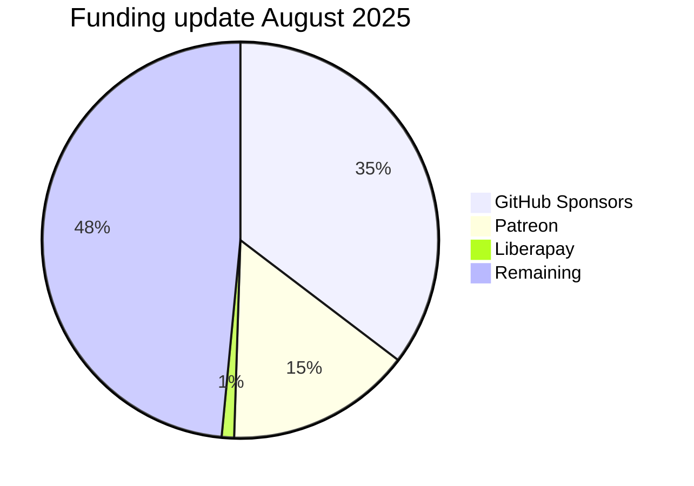

As we finish up work on [all of the features in the next release of Anubis](/docs/CHANGELOG#unreleased), I took a moment to add up the financials and here's an update on the recurring revenue of the project. Once I reach the [$5000 per month](https://github.com/TecharoHQ/anubis/discussions/278) mark, I can start reducing hours at my dayjob and start to make working on Anubis my full time job.

{/* truncate */}

Note that this only counts _recurring_ revenue (subscriptions to [BotStopper](/docs/admin/botstopper) and monthly repeating donations). Every one of the one-time donations I get is a gift and I am grateful for them, but I cannot make critically important financial decisions off of sporadic one-time donations.

:::note

All currency figures in this article are USD (United States Dollars) unless denoted otherwise.

:::

Here's the funding breakdown by income stream:

Assuming that some of my private support contracts and other sales effort go through, this will slightly change the shapes of this (a new pie chart segment will emerge for "Manual invoices"), but I am halfway there. This is a huge bar to pass and as it stands right now this is just enough income to pay for my monthly rent (not accounting for tax).

As a reminder, here's the rough plan for the phases I want to hit based on the _recurring_ donation totals:

| Monthly donations           | Details                                                                                                                                                                     |
| :-------------------------- | :-------------------------------------------------------------------------------------------------------------------------------------------------------------------------- |
| $0-5,000 per month          | Anubis is a nights and weekends project based on how much spare time and energy I have.                                                                                     |
| $5,000-10,000 per month     | Anubis gets 1-2 days per week of my time put into it consistently and I go part-time at my dayjob.                                                                          |
| $10,000-15,000 per month    | Anubis becomes my full time job. Features that are currently exclusive to [BotStopper](/docs/admin/botstopper/) start to trickle down to the open source version of Anubis. |
| $15,000 per month and above | I start planning hiring for Techaro.                                                                                                                                        |

If your organization benefits from Anubis, please consider donating to the project in order to make this sustainable. The fewer financial problems I have means the more that Anubis can become better.

## New funding platform: Liberapay

After many comments about the funding options, I have set up [Liberapay](https://liberapay.com/Xe/) as an option to receive donations. Additional funding targets will be added to Liberapay as soon as I hear back from my accountant with more information. All money received via Liberapay goes directly towards supporting the project.

## Next goals

Here's my short term goals for the immediate future:

1. Finish [Thoth](/docs/admin/thoth/) and run a backfill to mass issue API keys.
2. Document and publish the writeup for the multi-region Google Cloud spot instance setup that Thoth is built upon.
3. Release v1.22.0 of Anubis with Traefik support and other important fixes.
4. Continue growing the project into a sustainable business.
5. Work through the [blog backlog](https://github.com/TecharoHQ/anubis/issues?q=is%3Aissue%20state%3Aopen%20label%3Ablog) to document the thoughts behind Anubis and how parts of it work.

Thank you for supporting Anubis! It's only going to get better from here.
