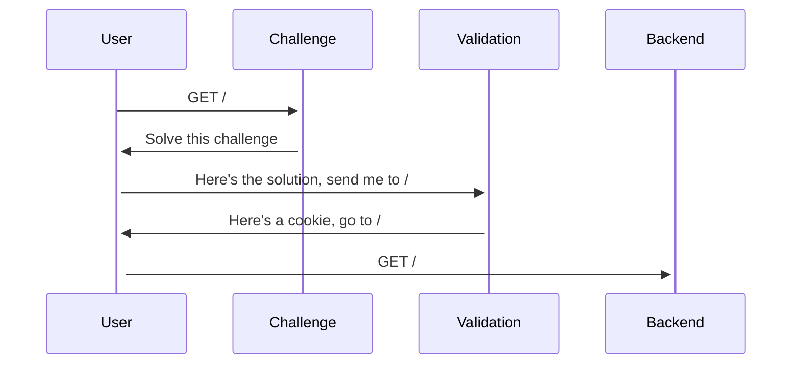
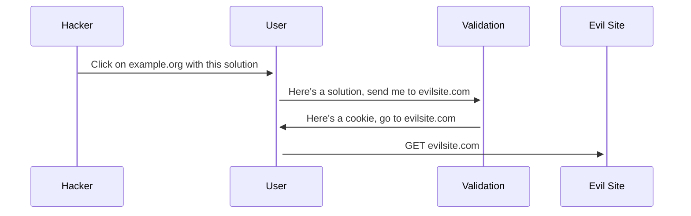

import Tabs from "@theme/Tabs";
import TabItem from "@theme/TabItem";

Anubis has an HTTP redirect in the middle of its check validation logic. This redirect allows Anubis to set a cookie on validated requests so that users don't need to pass challenges on every page load.

This flow looks something like this:



However, in some cases a sufficiently dedicated attacker could trick a user into clicking on a validation link with a solution pre-filled out. For example:



If this happens, Anubis will throw an error like this:

```text
Redirect domain not allowed
```

## Configuring allowed redirect domains

By default, Anubis may redirect to any domain which could cause security issues in the unlikely case that an attacker passes a challenge for your browser and then tricks you into clicking a link to your domain.
One can restrict the domains that Anubis can redirect to when passing a challenge by setting up `REDIRECT_DOMAINS` environment variable.
If you need to set more than one domain, fill the environment variable with a comma-separated list of domain names.
There is also glob matching support. You can pass `*.bugs.techaro.lol` to allow redirecting to anything ending with `.bugs.techaro.lol`. There is a limit of 4 wildcards.

:::note

If you are hosting Anubis on a non-standard port (`https://example:com:8443`, `http://www.example.net:8080`, etc.), you must also include the port number here.

:::

<Tabs>
  <TabItem value="env-file" label="Environment file" default>

```shell
# anubis.env

REDIRECT_DOMAINS="example.org,secretplans.example.org,*.test.example.org"
# ...
```

  </TabItem>
  <TabItem value="docker-compose" label="Docker Compose">

```yaml
services:
  anubis-nginx:
    image: ghcr.io/techarohq/anubis:latest
    environment:
      REDIRECT_DOMAINS: "example.org,secretplans.example.org,*.test.example.org"
      # ...
```

  </TabItem>
  <TabItem value="k8s" label="Kubernetes">

Inside your Deployment, StatefulSet, or Pod:

```yaml
- name: anubis
  image: ghcr.io/techarohq/anubis:latest
  env:
    - name: REDIRECT_DOMAINS
      value: "example.org,secretplans.example.org,*.test.example.org"
    # ...
```

  </TabItem>
</Tabs>
