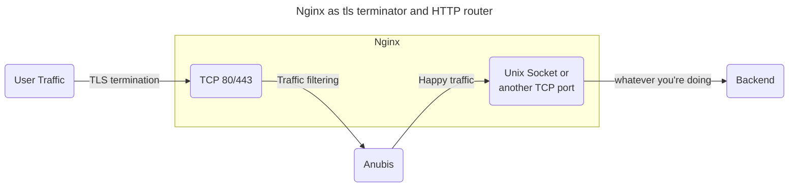

# Nginx

import CodeBlock from "@theme/CodeBlock";

Anubis is intended to be a filter proxy. The way to integrate this with nginx is to break your configuration up into two parts: TLS termination and then HTTP routing. Consider this diagram:



Instead of your traffic going right from TLS termination into the backend, it takes a detour through Anubis. Anubis filters out the "bad" traffic and then passes the "good" traffic to another socket that Nginx has open. This final socket is what you will use to do HTTP routing.

Effectively, you have two roles for nginx: TLS termination (converting HTTPS to HTTP) and HTTP routing (distributing requests to the individual vhosts). This can stack with something like Apache in case you have a legacy deployment. Make sure you have the right [TLS certificates configured](https://code.kuederle.com/letsencrypt/) at the TLS termination level.

:::note

These examples assume that you are using a setup where your nginx configuration is made up of a bunch of files in `/etc/nginx/conf.d/*.conf`. This is not true for all deployments of nginx. If you are not in such an environment, append these snippets to your `/etc/nginx/nginx.conf` file.

:::

Assuming that we are protecting `anubistest.techaro.lol`, here's what the server configuration file would look like:

import anubisTest from "!!raw-loader!./nginx/server-anubistest-techaro-lol.conf";

<CodeBlock language="nginx">{anubisTest}</CodeBlock>

:::tip

You can copy the `location /` block into a separate file named something like `conf-anubis.inc` and then include it inline to other `server` blocks:

import anubisInclude from "!!raw-loader!./nginx/conf-anubis.inc";

<CodeBlock language="nginx">{anubisInclude}</CodeBlock>

Then in a server block:

<details>
<summary>Full nginx config</summary>

import mimiTecharoLol from "!!raw-loader!./nginx/server-mimi-techaro-lol.conf";

<CodeBlock language="nginx">{mimiTecharoLol}</CodeBlock>

</details>

:::

Create an upstream for Anubis.

import anubisUpstream from "!!raw-loader!./nginx/upstream-anubis.conf";

<CodeBlock language="nginx">{anubisUpstream}</CodeBlock>

This can be repeated for multiple sites. Anubis does not care about the HTTP `Host` header and will happily cope with multiple websites via the same instance.

Then reload your nginx config and load your website. You should see Anubis protecting your apps!

```text
sudo systemctl reload nginx.service
```
